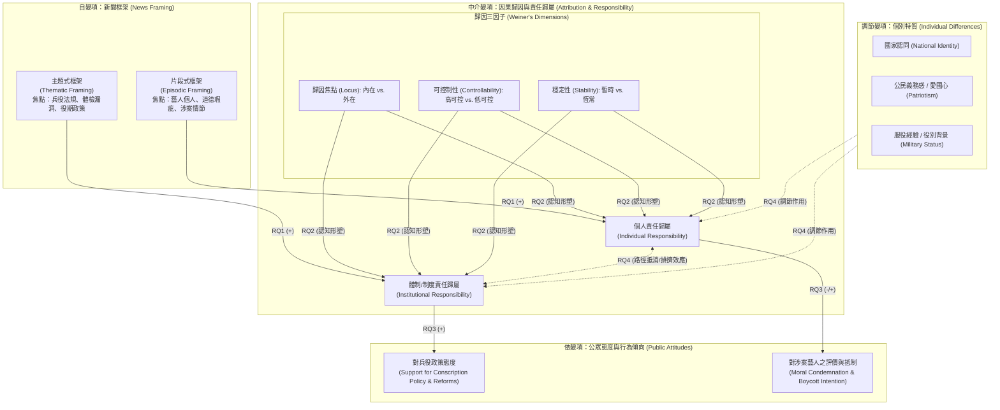

# 畢業論文研究計畫：新聞框架、責任歸屬與公眾態度——以臺灣藝人閃兵事件為例
Research Project: News Framing, Attribution of Responsibility, and Public Attitudes: A Study on Taiwan Celebrity Draft Evasion Incidents

---

## 專案基本資訊 (Project Overview)
- **研究題目**：新聞框架、責任歸屬與公眾態度：以2025年臺灣藝人閃兵事件為例
- **學術領域**：傳播學、政治心理學、公共政策傳播
- **核心研究主軸**：探討媒體不同新聞框架（片段式 vs. 主題式）如何透過閱聽人之責任歸屬中介機制（因果歸因三因子），進而影響公眾對現行兵役政策與涉案人物之態度，並檢驗國家認同等個別特質之調節效果。

---

## 四大核心研究問題 (Core Research Questions)

### RQ1：新聞框架效應（自變項 $\rightarrow$ 中介變項）
> **不同新聞框架（片段式框架 vs. 主題式框架）如何影響閱聽人對藝人閃兵事件之責任歸屬判斷（個人責任 vs. 體制/制度責任）？**
- **概念核心**：
  - 片段式框架（Episodic Framing）：聚焦於個案細節、藝人個人私德、違法手段與八卦獵奇，是否顯著誘發受眾傾向「個人責任歸屬」（Individual Responsibility）？
  - 主題式框架（Thematic Framing）：置於兵役法規缺陷、體檢判定標準漏洞、國防兵役改革脈絡，是否顯著誘發受眾傾向「體制/制度責任歸屬」（Societal/Institutional Responsibility）？

### RQ2：微觀歸因歷程（因果歸因三維度機制）
> **閱聽人對閃兵行為之責任歸屬，如何受到 Weiner 因果歸因理論三維度（歸因焦點、穩定性、可控制性）之具體形塑？**
- **概念核心**：
  - 歸因焦點（Locus of Causality）：內在動機（個人投機）vs. 外在環境（制度誘因/體制不公）。
  - 可控制性（Controllability）：閱聽人感知當事人是否具備自由意志與完全控制能力（如故意逃避 vs. 制度漏洞誘使）。
  - 穩定性（Stability）：暫時性單一弊端 vs. 長期系統性結構問題。

### RQ3：中介機制與公眾態度（中介變項 $\rightarrow$ 依變項）
> **責任歸屬判斷（個人責任 vs. 制度責任）是否在新聞框架與後續公眾態度（政策支持度、體制信任度、對藝人之道德評價與抵制意圖）之間扮演顯著的中介角色？**
- **概念核心**：
  - 當受眾形成體制歸責時，是否會轉化為對現行兵役制度（如一年制義務役改革）的檢討需求與改革支持？
  - 當受眾形成個人歸責時，是否主要導向對涉案藝人的道德譴責與抵制行為，而減弱對政策制度層面的關注？

### RQ4：個別特質調節與歸因路徑競爭（調節與互動效果）
> **受眾之個人特質（如國家認同、公民義務感、服役經驗）是否會調節新聞框架對責任歸屬與公眾態度之影響？此外，個人歸責與體制歸責兩者之間是否存在競爭或抵消效應（Trade-off / Crowding-out Effect）？**
- **概念核心**：
  - 調節效果（Moderation）：高國家認同/高公民義務感之受眾，在面對片段式框架時是否會引發更強烈的個人道德譴責與情感反應（如憤怒）？
  - 競合效應（Competing Paths）：強烈的個人道德咎責是否會排擠或轉移大眾對國防體檢制度瑕疵的檢討傾向？

---

## 概念架構心智圖 (Conceptual Architecture)



---

## 多維度中英文關鍵字群庫 (Keyword Clusters)

| 維度編號 | 維度名稱 | 中文關鍵字群 (Traditional Chinese) | 英文關鍵字群 (English Terms) |
| :--- | :--- | :--- | :--- |
| **Dim A** | **核心理論視角** | 新聞框架理論、歸因理論、認知歸因模型、責任歸屬模型、雙歷程理論 | Framing Theory, Attribution Theory, Weiner's Attributional Model, Attribution of Responsibility, Dual-Process Theory |
| **Dim B** | **自變項：框架呈現** | 片段式框架、主題式框架、事件框架、議題框架、媒體產製、新聞敘事 | Episodic Framing, Thematic Framing, Issue Framing, Event Framing, Media Production, Narrative Framing |
| **Dim C** | **中介：歸因與責任** | 責任歸因、個人責任、制度責任、體制歸因、歸因焦點、可控制性、穩定性、道德義憤 | Responsibility Attribution, Individual Responsibility, Societal/Institutional Responsibility, Locus of Causality, Controllability, Stability, Moral Outrage |
| **Dim D** | **依變項：政策與態度** | 兵役政策態度、國防改革支持度、制度信任度、公眾態度、道德譴責、公眾抵制意圖 | Conscription Policy Support, Military Reform Attitudes, Institutional Trust, Public Attitudes, Moral Condemnation, Boycott Intentions |
| **Dim E** | **調節：認同與背景** | 國家認同、愛國心、公民義務、國民意識、役男經驗、兵役身分、性別角色 | National Identity, Patriotism, Civic Duty, National Consciousness, Conscription Experience, Military Service Status, Gender Roles |
| **Dim F** | **事件情境與研究脈絡** | 藝人閃兵、免役爭議、逃避兵役、兵役體檢、一年制義務役、臺灣國防改革 | Draft Evasion, Military Exemption Controversy, Dodging Conscription, Conscription Physical Examination, One-Year Compulsory Military Service, Taiwan Defense Reform |

---

## 資料庫進階檢索策略 (Search Syntax Examples)

### 國際學術資料庫（Web of Science / Scopus / Communication & Mass Media Complete）
```text
("episodic frame*" OR "thematic frame*" OR "news framing") 
AND ("attribution of responsibility" OR "causal attribution" OR "locus of causality" OR "controllability") 
AND ("policy support" OR "public attitude*" OR "moral condemnation" OR "institutional trust") 
AND ("conscription" OR "military service" OR "draft evasion" OR "scandal" OR "celebrity")
```

### 中文學術資料庫（Airiti Library 華藝線上圖書館 / 臺灣博碩士論文知識加值系統）
```text
(「新聞框架」 OR 「片段式框架」 OR 「主題式框架」) 
AND (「責任歸屬」 OR 「歸因」 OR 「個人責任」 OR 「制度責任」) 
AND (「兵役」 OR 「國防政策」 OR 「政策態度」 OR 「國家認同」 OR 「閃兵」)
```
